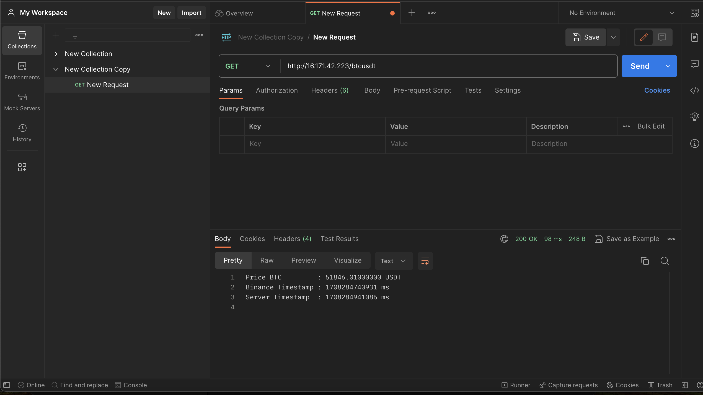
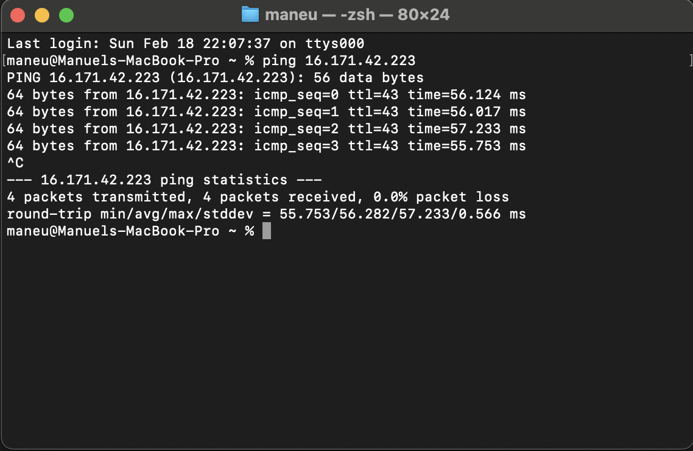

# BTC/USDT Price API

This repository contains the code for an API that, when prompted with a HTTP GET command, returns the most recent price for the pair BTC/USDT at Binance. The implementation is currently running on an AWS EC2 Ubuntu instance, accessible at the following IP address: `16.171.42.223`. A reverse proxy with Nginx is configured to forward all traffic coming to `http://16.171.42.223/btcusdt` to the correct port where the API is running.

## Example Usage

Here's an example of a command and response in Postman:



And a ping command:



The server also contains the following inbound security rules that only allow connections via SSH, ICMP, and HTTP:


## Architecture

The code is designed to be modular, addressing the separation of concerns and making it easy to expand the program to other types of feeds, such as data from other exchanges. It consists of four main modules:

- `web_socket_feed`: Connects to the exchange through a WebSocket connection, requests its data feed, and sends it to the API side, so that whenever a response is required, the data feed is available on its thread.
- `api_responder`: Handles the communication and functions to be executed on the API side.
- `binance_feed_processor`: Parses and polishes the data feed to be presented as a response to a request.

## Deployment

To deploy an instance of this code, ensure you have at least Rust installed and follow these steps:

1. Clone the repository
```
  git clone https://github.com/maneu96/priceAPI.git
```
2. Change directory into the newly created folder:
```
  cmd cd priceAPI
```
3. Run the program:
```
  cmd cargo run
```
